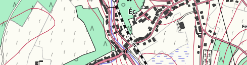

OpenArdenneMap
--------------

*Une carte pour l'Ardenne*



&nbsp;

::: ENGLISH BELOW :::

# A propos
OpenArdenneMap est un style de carte personnalisé basé sur OpenStreetMap. Il se fonde sur le style OSMBright et s'inspire, entre autres, de OpenTopoMap.

# Installation
## Logiciels
Si vous ne pouvez pas utiliser l'ensemble des scripts de ce dépôt, contactez-moi (nobohan.be#contact).

Il est conseillé d'utiliser un environnment virtuel Python. Les librairies suivantes sont installées:
* mapnik
* python-mapnik
* imposm
* carto
  * (Pour ces 4 premiers points, cfr l'installation de OSMBright)
* cloner ou télécharger les fichiers OpenArdenneMap
* télécharger les données OSM en fichier .osm (avec JOSM) ou bien en .pbf (par ex. sur download.geofabrik.de)

## Mise en place de la base de données postgresql
Lancer le script `create-db.sh`. Il faut l'éditer auparavant selon le chemin de votre environnement virtuel.

# Usage
## Pour changer les données OSM (import dans une db avec imposm)
Éditer le fichier `imposm-mapping.py`. Par rapport au style d'OSMBright, des éléments ont été ajoutés, comme le tracktype et leaf_type.

## Pour changer le style de la carte
Éditer les fichiers `mss` en utilisant le language cartoCSS et utiliser `carto` pour générer le fichier mapnik `OpenArdenneMap.xml`:
`carto cartoCSS/project.mml > cartoCSS/OpenArdenneMap.xml`

Pour générer la carte, faire:
`python makeMap.py`

Le tout:
`carto cartoCSS/project.mml > cartoCSS/OpenArdenneMap.xml && python makeMap.py`

## Mettre à jour la base de données avec imposm
Voici les commandes pour utiliser imposm avec la table de correspondance renseignée dans imposm-mapping.py. Utiliser un shapefile e.g.,  `map_extent.shp` pour resteindre l'import à une zone:
* `imposm --proj=EPSG:3857 --read belgium-latest.osm.bz2 --limit-to map_extent.shp -m imposm-mapping.py`
* `imposm -U osm -d osm -m imposm-mapping.py --write --optimize --deploy-production-tables --limit-to map_extent.shp`
* `imposm -d osm --remove-backup-tables`


Au lieu de processer un gros fichier tel que  belgium-latest.osm.bz2, vous pouvez télécharger directment votre zone d'intérêt avec JOSM. Sauver les données sous un fichier .osm (e.g., `extract.osm`) et l'utiliser avec imposm. C'est beaucoup plus rapide!
* `imposm --proj=EPSG:3857 --read extract.osm -m imposm-mapping.py`
* `imposm -U osm -d osm -m imposm-mapping.py --write --optimize --deploy-production-tables`
* `imposm -d osm --remove-backup-tables`

Le tout:

`imposm --proj=EPSG:3857 --read extract.osm -m imposm-mapping.py && imposm -U osm -d osm -m imposm-mapping.py --write --optimize --deploy-production-tables && imposm -d osm --remove-backup-tables`


# Changements apportés à OSMBright

OSMBright est un style par défaut pour les données d'OSM. Mais il est principalement adapté aux milieux urbains. Ce style a été profondémment modifié. Voici quelques exemples de modifications.

## 1) Simplification
Pour le moment, ce dépôt n'est pas destiné à générer des tuiles à différents niveaux de zooms, mais plutôt de générer de grandes cartes papier à imprimer, à une haute résolution / grande échelle. Le style d'OSMBright a donc été fortement simplifié:
* Pas de niveaux de zoom
* Pas de couches généralisées pour les petites échelles.

## 2) Ajouts de nouveaux éléments

### 2.1) En ajoutant des champs à une table existante
1) Ajouter le nom du champ + le type de champ (boolean, numeric, string) à une table existante.

```
    fields = (
            ...
            ('surface', String()),
            ('tracktype', String())
            )
```

2) Ensuite, ajouter le nom du champ dans `project.mml` dans la couche où ce champ est utilisé.

```
"table": "( SELECT geometry, type, tunnel, bridge, surface, tracktype, access, ...
```

3) Enfin, définir un style particulier pour la propriété "tracktype" dans le bon fichier mss.

```
[tracktype='grade1'] { line-width: @rdz16_min / 2; }
```


### 2.2) En ajoutant une nouvelle table
1) Vous pouvez créer une nouvelle table avec des étiquettes OSM et une sélection de champs dans `imposm-mapping.py`. Voir par exemple la table nommée "linearfeatures" avec les étiquettes "man_made=embankment" et "embankment=yes". Noter la virgule à la fin des valeurs des clés, même avant de fermer la paranthèse!


```
linearfeatures = LineStrings(
   name = 'linearfeatures',
   mapping = {
           'man_made': (
              'embankment',
           ),
            'embankment': (
               'yes'
            ),
       },
)
```

2) Ensuite, ajouter une couche dans `project.mml`:

```
{
  "Datasource": {
    "dbname": "osm",
    "extent": "-20037508.34,-20037508.34,20037508.34,20037508.34",
    "geometry_field": "geometry",
    "id": "linear_features",
    "key_field": "",
    "srs": null,
    "table": "( SELECT geometry, type\n  FROM osm_linearfeatures\n)  AS data",
    "type": "postgis"
  },
  "class": "",
  "geometry": "linestring",
  "id": "linear_features",
  "name": "linear_features",
  "srs": "+proj=merc +a=6378137 +b=6378137 +lat_ts=0.0 +lon_0=0.0 +x_0=0.0 +y_0=0.0 +k=1.0 +units=m +nadgrids=@null +wktext +no_defs +over",
  "srs-name": "900913",
  "status": "on"
},
```


3) Enfin, définir un style dans l'un des fichiers mss.

`#linear_features: { ... }`

## 3) Ajout d'une troisième couche à certaines routes

Avec Mapnik, comme dans beaucoup de logiciels cartographiques, on obtient des symbologies complexes pour les routes en superposant plusieurs couches avec différentes épaisseurs. Par exemple, une route rendue avec une bande blanche bordée par 2 lignes noires est obtenue en superposant une deuxième couche avec une fine ligne blanche au-dessus d'une première couche constituée d'une large bande noire.

Pour afficher des symboles encore plus complexes, on peut avoir besoin d'une troisième couche. Dans OpenArdenneMap, les chemins principaux (tracktype=1) sont rendus avec une ligne alternant le rouge et le blanc bordé par 2 lignes noires. Cette couche a des propriétés cartoCSS sous `#roads::top`.


## 4) Personnalisation du style cartographique

Bien sûr, outre les additions, le style de la carte a été fortement modifié. Les principales modifications sont:

* Augmentation des tailles de police
* Choix de couleurs
* Création de symboles
* Création de patterns


# Courbes de niveaux

## Génération des courbes de niveaux

Les courbes de niveaux ont été générées depuis un modèle numérique de terrain (raster) en utilisant l'outil GRASS `r.contour.step` dans QGIS.
L'incrément entre les courbes a été fixé à 5 m. Le nombre minimulm de points pour avoir une courbe a été fixé à 20. Cet outil offre plus d'options que l'outil GDAL `gdal_contour`.

La couche a ensuite été post-processée pour obtenir des géométries plus courbes. L'outil `v.generalize.smooth` a été utilisé, avec l'algorithme "snakes" (paramètres par défaut).

## Représentation des courbes de niveaux

Les courbes de niveaux ont été enregistrées au format shp et sont chargées en tant que deuxième couche (en partant du bas) dans `project.mml`.

Les labels des courbes de niveaux sont définis dans `labels.mss`.

## 5) Impression
Quelques commandes utiles pour l'impression en pdf:

* Déterminer la taille d'un pdf:
`pdfjam --outfile A2.pdf --landscape --paper a2paper in.pdf`

* Faire plusieurs A4 d'un A2:
`pdfposter -ma4 -pa2 A2.pdf out_A4.pdf`


&nbsp;

&nbsp;

&nbsp;

::: ENGLISH :::

# About
OpenArdenneMap is a customized map using OpenStreetMap data. It is based on OSMBright and inspired by OpenTopoMap.


# Installation

## Stack
* This was developed inside a python virtual environment
* Install Mapnik & python-mapnik
* Install impsom
* Install carto
  * (For these last three points, have a look at OSMBright)
* Clone or download the OpenArdenneMap files
* download the OSM data as a .osm file (using JOSM) or as a .pbf file (e.g. on download.geofabrik.de)

## Set up the postgresql database
Run the script `create-db.sh`. Edit it before according to the path of your virtual environment.

# Usage
## To change the way the OSM data are imported
Edit the imposm-mapping.py file. Some features are added in OpenArdenneMap, such as tracktype and leaf_cycle/leaf_type. See below.

## To change the style of the map
Edit the mss files using cartoCSS language and use `carto` to generate the `OpenArdenneMap.xml` mapnik file. Then:
`carto cartoCSS/project.mml > cartoCSS/OpenArdenneMap.xml`

To generate the map:
`python makeMap.py`

All together:
`carto cartoCSS/project.mml > cartoCSS/OpenArdenneMap.xml && python makeMap.py`

## Update the db using imposm
Here are the commands for using imposm with this imposm-mapping. Use a shp called e.g. `map_extent.shp` to select a particular area:
* `imposm --proj=EPSG:3857 --read belgium-latest.osm.bz2 --limit-to map_extent.shp -m imposm-mapping.py`
* `imposm -U osm -d osm -m imposm-mapping.py --write --optimize --deploy-production-tables --limit-to map_extent.shp`
* `imposm -d osm --remove-backup-tables`
* `./make.py` in osm-bright-master

Instead of processing the whole belgium-latest.osm.bz2 file, you can download directly the OSM data using JOSM, save as a .osm (e.g., `extract.osm`) file and use it with imposm. It is much faster.
* `imposm --proj=EPSG:3857 --read extract.osm -m imposm-mapping.py`
* `imposm -U osm -d osm -m imposm-mapping.py --write --optimize --deploy-production-tables`
* `imposm -d osm --remove-backup-tables`

All together:

`imposm --proj=EPSG:3857 --read extract.osm -m imposm-mapping.py && imposm -U osm -d osm -m imposm-mapping.py --write --optimize --deploy-production-tables && imposm -d osm --remove-backup-tables`

# Changes compared to OSMBright

## 1) Simplification of OSMBright
Currently, my goal is not to generate map tiles at different zoom levels, but rather to generate large map file for printing paper maps, at a fairly high resolution/large scale. As a result, the OSMBright styles was highly simplified:
* no zoom levels are considered
* no generalized layers are used, no roads_low or roads_med

## 2) Addition of new features

### 2.1) By adding some fields to an existing table
1) Add the field names + type of the field (boolean, numeric, string) to an existing table.

```
    fields = (
            ...
            ('surface', String()),
            ('tracktype', String())
            )
```

Compared to the default OSMBright style, some features were added in the imposm-mapping.py file:
* The tracktype=* and surface=* keys for highway=track
* The leaf_type=* & leaf_cycle=* keys for landuse=forest

2) Then, the field name should be added in `project.mml` in the layer where this field should be used.
Example:

```
"table": "( SELECT geometry, type, tunnel, bridge, tracktype, access, ...
```

3) Lastly, for defining a specific style for, e.g., the tracktype, do it in the right mss style file.

```
[tracktype='grade1'] { line-width: @rdz16_min / 2; }
```


### 2.2) By adding a new table
1) You can create a new table with a specific tag and fields selection in `imposm-mapping.py`. See for instance how to create a table named 'linearfeatures' with the tags 'man_made=embankment' and 'embankment=yes'. Note that the commas at the end of the values of the keys are needed, even before a closing bracket!

```
linearfeatures = LineStrings(
   name = 'linearfeatures',
   mapping = {
           'man_made': (
              'embankment',
           ),
            'embankment': (
               'yes'
            ),
       },
)
```

2) Then add a specific layer in `project.mml`:

Example for the layer linear_features:
```
{
  "Datasource": {
    "dbname": "osm",
    "extent": "-20037508.34,-20037508.34,20037508.34,20037508.34",
    "geometry_field": "geometry",
    "id": "linear_features",
    "key_field": "",
    "srs": null,
    "table": "( SELECT geometry, type\n  FROM osm_linearfeatures\n)  AS data",
    "type": "postgis"
  },
  "class": "",
  "geometry": "linestring",
  "id": "linear_features",
  "name": "linear_features",
  "srs": "+proj=merc +a=6378137 +b=6378137 +lat_ts=0.0 +lon_0=0.0 +x_0=0.0 +y_0=0.0 +k=1.0 +units=m +nadgrids=@null +wktext +no_defs +over",
  "srs-name": "900913",
  "status": "on"
},
```


3) Finally, define a style for this layer in one the mss files:

`#linear_features: { ... }`


## 3) Addition of a third outline for roads
In Mapnik, like in many cartographic software, you can render complex road symbology using superimposed layer with different width, e.g., a simple road rendered as a white band bordered by black lines is actually made by a first layer where roads are rendered using a large black band + a second layer (on top of it) where roads are rendered with a thinner white band.

For displaying complex road symbols, one may need a third layer. For instance, in OpenArdenneMap, large tracks (track_type = 1) are rendered with a dash white-red line bordered by a black line.
This third layer have cartoCSS properties under `#roads::top`.


## 4) Customisation of the map style
Of course, the style of the map was modified, with some inspiration taken from OpenTopoMap and other topographic maps. Main modifications are:
* increase font size
* custom colors
* Symbol creation
* Pattern creation.

# Contour lines

## Contour lines generation
Contour lines were generated from a digital elevation model (raster) using the GRASS tool `r.contour.step` in QGIS. Increment between contour levels was set to 5 m. Minimum number of points for a contour line was set to 20. This tool offers more options that the default QGIS tool from gdal (`gdal_contour`).

## Contour lines representation
Contour lines should be post-processed in order to have smooth geometries. The GRASS tool `v.generalize.smooth` was used, with the "snakes" algorithm (with default parameters).

Contour lines were saved as shp and loaded as the second layer (from bottom) in project.mml.

Contour labels are defined in `labels.mss`.

## 5) printing
Some useful commands for printing the map in a pdf format:

* Determining the size of a pdf:
`pdfjam --outfile A2.pdf --landscape --paper a2paper in.pdf`

* Make several A4 of a A2 pdf:
`pdfposter -ma4 -pa2 A2.pdf out_A4.pdf`


# TODOs

* unused railways
* electric lines: power=tower + power=line
