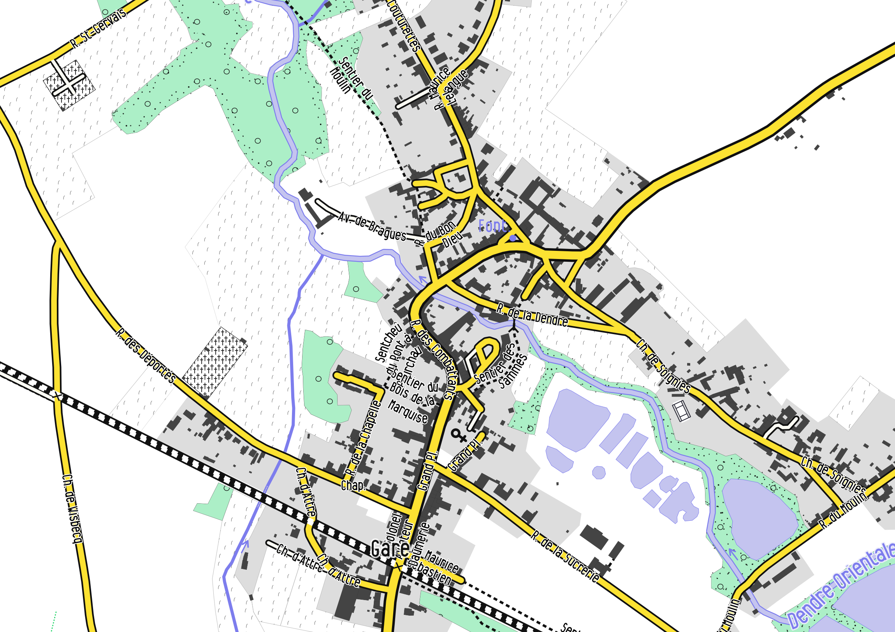
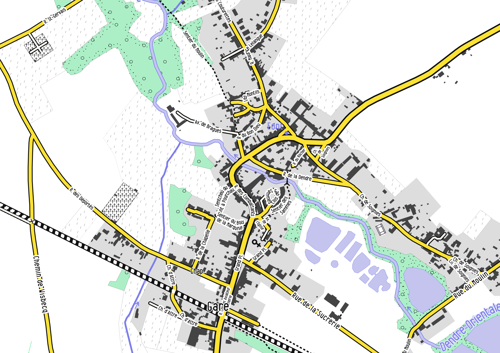

Street labelling with Mapnik
----------------------------


# How it is done in the default "Mapnik-style on osm.org


See the layer `#roads-text-name`. It uses the following properties:

```
text-name: "[name]";
text-size: 8;
text-fill: black;
text-spacing: 300;
text-clip: false;
text-placement: line;
text-halo-radius: @standard-halo-radius;
text-halo-fill: @residential-fill;
text-face-name: @book-fonts;
text-repeat-distance: @minor-highway-text-repeat-distance;
```

Note that there is also a shield for the road reference.


# How it is done in OpenArdenneMap (from OSMBright)

* there is a layer "street_label", which is a point layer
* it uses the following properties:
```
text-name:'[name]';
text-face-name: @sans;
text-placement: line;
text-wrap-width: 400;
text-character-spacing: 2;
text-line-spacing: 1;
text-fill: @road_text;
text-halo-fill: #ffffff;
text-halo-radius: 2;
text-allow-overlap: true;
text-size: @text_size_xs;
```

where:
* text-placement: line; is important for street labeling.
* text-allow-overlap: true; allows street labels to overlap with other text layers.


# How to force labelling

Due to its collision algorithm, Mapnik won't necessarily display all the street names that exists. However, often, you want to maximise the number of street names that are displayed. Here are some tricks to do so:

Suppose you have a street layer with street names in the field "name", some basic instructions to render street labels are the following:
```
text-name:'[name]';
text-face-name: @sans;
text-size: @text_size_s;
```
where `@text_size_s` is equal to 35.


This is not looking really nice. We can tell Mapnik to follow the street lines with `text-placement:line;` and also put a halo around the street labels.


## Decrease the `text-size` of the label

A very efficient way to display more labels! But obviously, you cannot decrease too much the text size, especially in case of printed paper maps.


## Set `text-allow-overlap: true`.

By default, Mapnik will avoid to superimpose labels from **the same layer**. In case of street however, it is reasonable to allow the overlap of labels, as it would cause problems only around crossroads. In our case, we gain one more label.


## Set "clear-label-cache": "on" in the project file

Mapnik will also avoid to have collision between labels from **the other layers**. For disabling this anti-collision effect between layers, `text-allow-overlap` has no effect. You have to set the parameter "clear-label-cache":"on" in the project file to the layer. In cartoCSS, this is done by writing this parameter inside the "properties" of the layer in your "project.mml" file (and not in the cartoCSS mss files):
```
{
"name": "street_label",
"Datasource": { ... },
"properties": { "clear-label-cache": "on" },
...
}
```

## Replace some text by some abbreviations

Quite efficient, since it will decrease the length of yours labels. In Mapnik, this can be done directly in the project file by defining some replacement rules. If you work with a PostGIS database, use some SQL statements with the SQL function `replace`. To replace several words, the "replace" statements can be nested as follows:

```sql
replace(replace(replace(replace(replace(replace(name, 'Rue', 'R.'), 'Saint', 'St'), 'Chemin', 'Ch.'), 'Place', 'Pl.'), 'Avenue', 'Av.'), 'Boulevard', 'Bd.') AS short_name
```

where we abbreviate here some commons words encountered in French street names. In our case, we did not gain so much labels, but it is more readable and in some cases (or if you use stronger abbreviations, for instance for very long street names), the gain can be considerable.


## Wrap the labels

Labels can be wrapped using the `text-wrap-width` parameter. The smaller the value (in pixels, not the number of letters), the sooner the text will wrap in 2 or more lines.


We gained quite a lot of labels, although this is a little bit readable.


## Increase the maximum angle for curving the Labels

If you have particularly highly-curved streets where Mapnik does not want to print the labels, increase the `text-max-char-angle-delta` value. It will increase the curvature of the labels which may help in some cases to display more labels! By default, this parameter has a value of 22.5°. Here we increased it to 50°:


## Merge the streets that are adjacents

Often, the street in OSM are split at numerous points for various reasons (because other tags are present, simply because the user digitalize in several segments, ....). In our example, this causes some unwanted repetitions of the street label along the same street (Rue du Moulin, Rue de la Sucrerie, ...)

To avoid such repetition of the same label along a split street, we can merge the adjacent segments together after having grouping the street by their name, directly in the SQL query:

```sql
SELECT name, ST_LineMerge(ST_Union(way)) AS way, highway
FROM planet_osm_line
WHERE "highway" IS NOT NULL AND "name" IS NOT NULL
GROUP BY name, highway
```



This last map has "lost" some labels because of the adjacent street merging. If you still want some repetitions of labels, then you can set the `text-repeat-distance` parameter for repeating the labels and having full control on it.

## Mixing the rules

A nice render can be achieved when mixing the above-mentioned properties and especially by setting rules based on the street length.

For instance, the following lines set 5 different street labeling behaviours based on the street length:

```
#street_label {
  text-name:'[very_short_name]';
  text-face-name: @sans;
  text-size: @text_size_xxs;
  text-placement: line;
  text-halo-fill: #ffffff;
  text-halo-radius: 6;
  text-allow-overlap: true;
  text-max-char-angle-delta: 70;
  [length <= 100] {
    text-name: '[very_short_name]';
    text-wrap-width: 20;
    text-size: @text_size_xxs;
  }
  [length > 100] {
    text-name: '[very_short_name]';
    text-wrap-width: 100;
    text-size: @text_size_xxs;
  }
  [length > 150]{
    text-name: '[short_name]';
    text-wrap-width: 100;
    text-size: @text_size_xs;
  }
  [length > 400]{
    text-name: '[short_name]';
    text-wrap-width: 200;
    text-size: @text_size_xs;
  }
  [length > 1800]{
    text-name: '[name]';
    text-wrap-width: 600;
    text-size: @text_size_s;
    text-repeat-distance: 2000;
    text-character-spacing: 2;
  }
}
```

where `[short_name]` is an abbreviated name and `[very_short_name]` an even more abbreviated name.  For smallest streets (<=100 pixels), street names will be abbreviated and wrapped after only 20 pixels. The second and third rules increases the wrapping distance while the last one also increase the `text-character-spacing`.



## Other tips and useful parameters

* Decrease the `text-character-spacing` will also condense your text labels, and so could help to place more labels. However, the default is already the smallest value.

* Use `text-simplify`. You can use this parameter to simplify the geometry that is labeled. It seems it can have a (limited) effect on the label placement: some labels have disappeared and some others appeared when testing this parameter.

* `text-repeat-distance` is very useful when making rules based on the length of the street. Put some values (in pixels) to increase the distance between two labels when labels are repeated along a same feature.

* `text-label-position-tolerance` : The default value will in general maximise the positioning, but smaller values can reduce the number of text labels.


# Other ideas
* Set the main street in bold / larger font size?
* change font-style de sentier/track

# Inspirations from paper maps

* carte de Bxl Atelier Perspective 2010, 1 cm -> 100 m (1/10000)


# Reading
## Tilemill official doc
https://tilemill-project.github.io/tilemill/docs/guides/labels-advanced/

## Some obscure QA threads
https://gis.stackexchange.com/questions/220890/mapnik-cartocss-make-text-labels-overlap-other-layers-but-not-each-other
