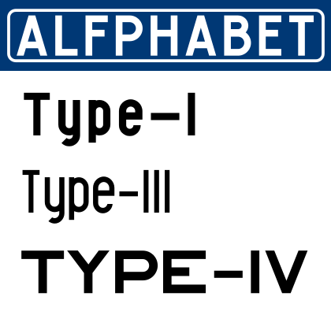

  

### Historical background

The Alfphabet family is based on the Belgian road signage called ‘Alphabet’ in French and ‘Alfabet’ in Flemish. It seems that it is introduced in 1945 by 3M system working for the Marshall plan after the end of the war. In 1975, it is replaced by the Swiss SNV fonts, but is in 2018 still in used randomly by the Belgian railroad and Charleroi’s metro. In the early nineties, Pierre Huyghebaert is able to copy the original plates just before the split of the national office of the roads ‘Fond des Routes’ in three regional entities and the burial of the documents deep into regional archives.

Alfphabet Condensed is a rough merge between Alfphabet II (condensed caps only) and Alfphabet III (semi-condensed lowercase only!). It is redrawn in various occasions by Karl Bassil and Pierre under Hammerfonts umbrella in Brussels, then completed at Mind the gap studio in Beirut by Karl with the help of Nadim Zablit in the late nineties. The contrast between uppercase and lowercase is still quite non-typographic, and lots of diacritics need improvement.

Alfphabet IV is redrawn by Pierre and Ludi Loiseau at Speculoos studio in 2007.

### Backstage

> *2011/9/17 Benoit Brunel* <<del datetime="2011-10-02T08:32:41+00:00">xxx</del>@gmail.com>:  
> Justement ça concerne l’article, j’ai besoin de quelques informations  
> et je sais que tu as les réponses.  
> Tu me disais que Michel Olive avait proposé un système de fonts pour…  
> la SNCB ou la STIB ?  
> Pour les deux, quel est le système en place? D’où vient-il? Belge?
>
>>*2011/10/2 Pierre Huyghebaert* <<del datetime="2011-10-02T08:32:41+00:00">xxx</del>@speculoos.com>  
>>Michel Olyff a répondu à un appel de ce qui s’appelait le fond des routes, national, vers 1975.  
>>Ils utilisaient jusque là des caractères que les planches appellaient Alfabet ou Alphabet selon la langue.  
>>Il y avait le type I, II, III, IV et V soit des chasses différentes en majuscules et une “police” juste pour les minuscules!  
>>Son nouveau système signalétique une fois au point, très moderniste type Frutiger, il a fait produire une étude comparative de lisibilité, sur un mode scientifique typique des années 70.  
>>Mais le fonctionnaire cadre en poste à l’époque, que j’ai rencontré à la fin de sa carrière et juste après le démantèlement régional de son institution fin des années 90, m’a expliqué avoir reculé devant le prix demandé par Olyff, pourtant raisonnable : 800000 francs belges soit 20000 euros, qui à l’époque devait bien valoir le double. Il a décidé d’opter pour la SNV suisse, gratuite…  
>>La SNCB continue parfois a utiliser l’Alfphabet, vaille que vaille, dans des versions très mal vectorisées, et mélangées au pire, type Arial.  
>>La STIB l’a aussi utilisé mais a depuis longtemps varié ses choix, largement vers l’Helvetica dans la métro, et depuis quelques années avec son changement d’identité, une fonte custom transitionnelle à la hollandaise.

## Content of the directory

- Type-I (Actually Type-I uppercase with Type-V lowercase)  
    - UFO & OTF files
    - SFD working file
- Type-III (Actually Type-III uppercase with Type-V readapted-lowercase)
    - UFO & OTF files
    - SFD working file
- Type-IV (Type-IV is uppercase only)
    - UFO & OTF files
    - SFD working file

- Fontlog  

- OFL Licence + FAQ  

## Known issues and future developments

- Diacritics need improvement

- Contrast between uppercase and lowercase (Type-I/III) is still quite non-typographic

## Coverage

- Alfphabet I currently provides the following Unicode coverage:
    - Basic Latin: 93/95 
    - Latin-1 Supplement: 66/96 
    - Latin extended A: 4/128

- Alfphabet III currently provides the following Unicode coverage:
    - Basic Latin: 95/95 
    - Latin-1 Supplement: 95/96 
    - Latin extended A: 3/128

- Alfphabet IV currently provides the following Unicode coverage:
    - Basic Latin: 95/95 
    - Latin-1 Supplement: 60/96 

## Information for Contributors

Copyright 1992-2014 Hammerfonts and OSP (Karl Bassil, Nadim Zablit, Pierre Huyghebaert, Ludivine Loiseau).

Alfphabet is released under the OFL 1.1 -- http://scripts.sil.org/OFL For information on what you're allowed to change or modify, consult the ofl.txt and ofl-faq.txt files. The ofl-faq also gives a very general rationale and various recommendations regarding why you would want to contribute to the project or make your own version of the font.
## ChangeLog

To do

## Acknowledgements

If you make modifications be sure to add your name (N), email (E), web-address (W) and description (D).  
This list is sorted by last name in alphabetical order. 

N: Karl Bassil    
E: karl.bassil@mindthegap.com.lb    
W: http://www.mindthegap.com.lb    
D: Typography

N: Pierre Huyghebaert  
E: pierre@speculoos.com   
W: http://www.speculoos.com    
D: Typography

N: Ludi Loiseau    
E: hello@ludi.be    
W: http://www.ludi.be   
D: Typography

N: Nadim Zablit   
E: nadim.zablit@scopeateliers.com    
W: http://scopeateliers.com     
D: Typography